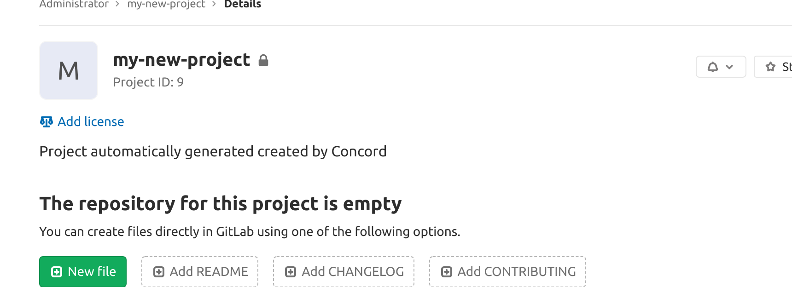

# Concord Observer Gitlab

The gitlab observer schedules tasks against resources in an gitlab server.

### Usage
To build the docker image run:

`make build`

To run the full test suite run:

`make test`

To run the short (dependency free) test suite run:

`make test-short`

### Environment
**`CONCORD_CONTROLLER_HOST`**

The `<host>:<port>` of the concord controller service. Used in Watcher mode to complete tasks.

**`CONCORD_STATUS_CHANGE_NOTIFIER_HOST`**

The `<host>:<port>` of the concord status change notifier service.

**`GITLAB_TOKEN`**

The API token the observer will use to interact with the Gitlab API.

**`GITLAB_BASE_URL`**

The base url of the Gitlab server. Ex: `http://mygitlab.example.com`

### Current Functionality
This observer can create gitlab pipeline tasks. It will create a trigger named "concordTrigger" in the project<br>
if it does not exist, and start the trigger pipeline.

There are two task modes:
- Async mode: Starts the task only. It is the job of the spawned pipeline to update the status in Concord regarding completion or failure.
- Watcher mode: Starts the task, then monitors the status. The observer will update Concord at the end of the run.

Sample jsonrpc payloads to Concord for pipelines:

Async:<br>
```
{"jsonrpc": "2.0", "method": "addTask", "params": {
	"key": "my-project", "meta": {
    "service": "gitlab",
    "type": "pipeline",
	  "resource": "my-project",
	  "async": true,
      "options": {
    	  "project": {
            "id": "6"
    	      "path": ""
    	  },
    	  "ref": "master",
          "variables": {
            "mytriggervar": "helloworld",
            "target": "blah.example.com"}
          }
        },"priority": 2.1}, "id":1}
```

Watcher mode:<br>
The observer defaults to async: false, removing the async variable or setting it to false will
start the task in Watcher mode.
```
{"jsonrpc": "2.0", "method": "addTask", "params": {
	"key": "my-project", "meta": {
    "service": "gitlab",
    "type": "pipeline",
	  "resource": "my-project",
      "options": {
    	  "project": {
            "id": "6"
    	      "path": ""
    	  },
    	  "ref": "master",
          "variables": {
            "myothertriggervar": "helloworld"
            "target": "blah.example.com"}
          }
        },"priority": 2.1}, "id":1}
```

Resulting pipeline in Gitlab:


The observer can also create projects, but that's all at the moment.
Project deletion is a future feature.
The jsonrpc payload for projects is much simpler, but could change a lot.

```
{"jsonrpc": "2.0", "method": "addTask", "params": {
	"key": "blah4.cisco.com", "meta": {
    "service": "gitlab",
    "type": "project",
	"resource": "my-new-project",
    "options": {
    	"project_namespace": "root",
    	"project_name": "my-new-project"}
      },"priority": 2.1}, "id":1}
```

Resulting project in Gitlab:

